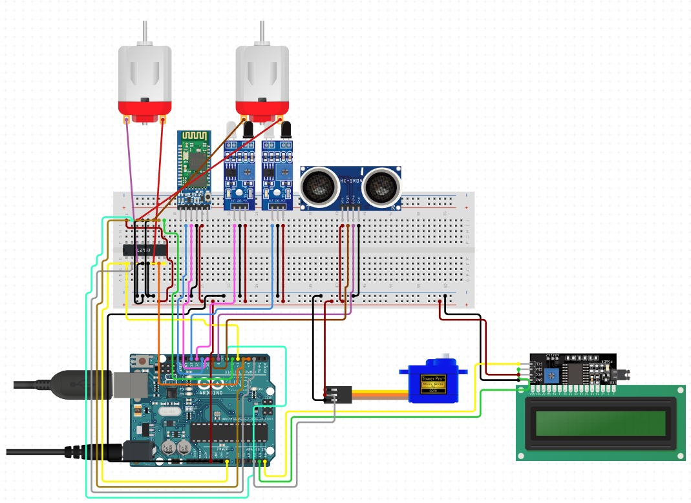
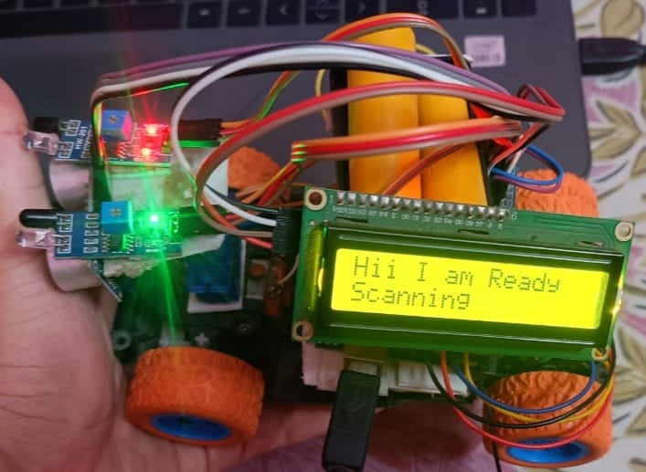

# 🚗 Obstacle Avoiding & Bluetooth Controlled Arduino Car

A unique blend of automation and manual control, this Arduino-powered car is capable of **navigating obstacles autonomously** using real-time sensor data and can also be **manually controlled via Bluetooth**. Designed as a stepping stone into the world of smart robotics, this project combines embedded systems, sensor integration, and mobile control to deliver a powerful learning and development platform.

---

## 🧠 Key Features

- **Dual Mode Operation**
  - 🔄 **Autonomous Mode:** Detects and avoids obstacles using ultrasonic and IR sensors.
  - 📱 **Manual Mode:** Controlled via smartphone through Bluetooth (HC-05).

- **Smart Navigation**
  - Uses servo-mounted ultrasonic sensor for dynamic obstacle detection.
  - Smooth, accurate motion through decision-making algorithms.

- **Affordable & Expandable**
  - Built using low-cost components.
  - Future integration possible with AI, GPS, and IoT platforms.

---

## ⚙️ Components Used

| Component                  | Quantity |
|---------------------------|----------|
| Arduino Uno               | 1        |
| Ultrasonic Sensor (HC-SR04) | 1        |
| IR Sensors                | 2        |
| Servo Motor (SG90)        | 1        |
| DC Gear Motors            | 2        |
| Motor Driver (L293D)      | 1        |
| Bluetooth Module (HC-05)  | 1        |
| 9V Battery + Holder       | 1        |
| Robot Chassis             | 1        |
| Jumper Wires              | As needed |

---

## 🧩 System Architecture

- **Sensor Processing:** Servo motor rotates the ultrasonic sensor for front obstacle scanning.
- **Decision Logic:** Arduino processes sensor data to determine safe movement.
- **Manual Control:** Bluetooth module receives directional commands from a mobile app.
- **Motor Control:** L293D handles forward, backward, and directional motion.

---

## 📲 Bluetooth Command Guide

| Command | Action        |
|---------|---------------|
| F       | Move Forward  |
| B       | Move Backward |
| L       | Turn Left     |
| R       | Turn Right    |
| S       | Stop          |

Use apps like **Bluetooth RC Controller** or **Arduino Bluetooth Controller**.

---

## 🔌 Circuit Diagram

> Below is the wiring diagram for the project. It shows the connection between Arduino, sensors, Bluetooth, motor driver, and motors.

> ℹ️ Make sure to connect:
> - HC-SR04 to pins 9 (Trig) and 10 (Echo)
> - Servo to pin 6
> - IR sensors to analog pins A0 and A1
> - L293D to pins 2, 3, 4, 5
> - HC-05 to RX/TX (with voltage divider on RX)

---

## 🤖 Real Assembled Car

> Here's an image of the final assembled robotic car with all components mounted and wired properly.

---

## 🛠 Learning Outcomes

- Microcontroller programming using **Arduino IDE**
- Real-time sensor interfacing and data analysis
- Implementation of decision-making logic
- Wireless control via Bluetooth
- System integration and embedded design

---

## 🚀 Future Enhancements

- 🤖 AI-based object recognition or path planning
- 🌍 GPS-based location-aware navigation
- ☁️ IoT integration for remote monitoring and control
- 🔋 Solar charging or power optimization for energy efficiency

---

## 👨‍💻 Developed By

**Kunal Gautam**  
📧 [kunalgautam489@gmail.com](mailto:kunalgautam489@gmail.com)  
🔗 [GitHub](https://github.com/kunal654) | [LinkedIn](https://www.linkedin.com/in/kunal-gautam-2981b2292/)

---

